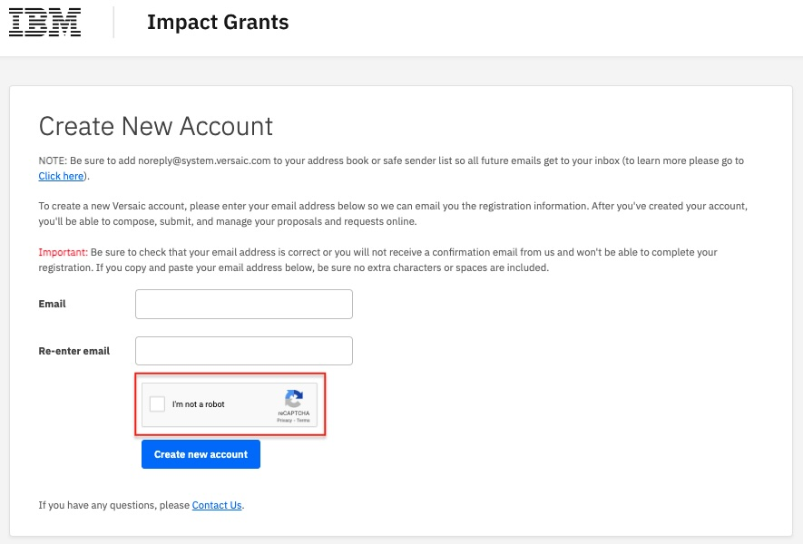
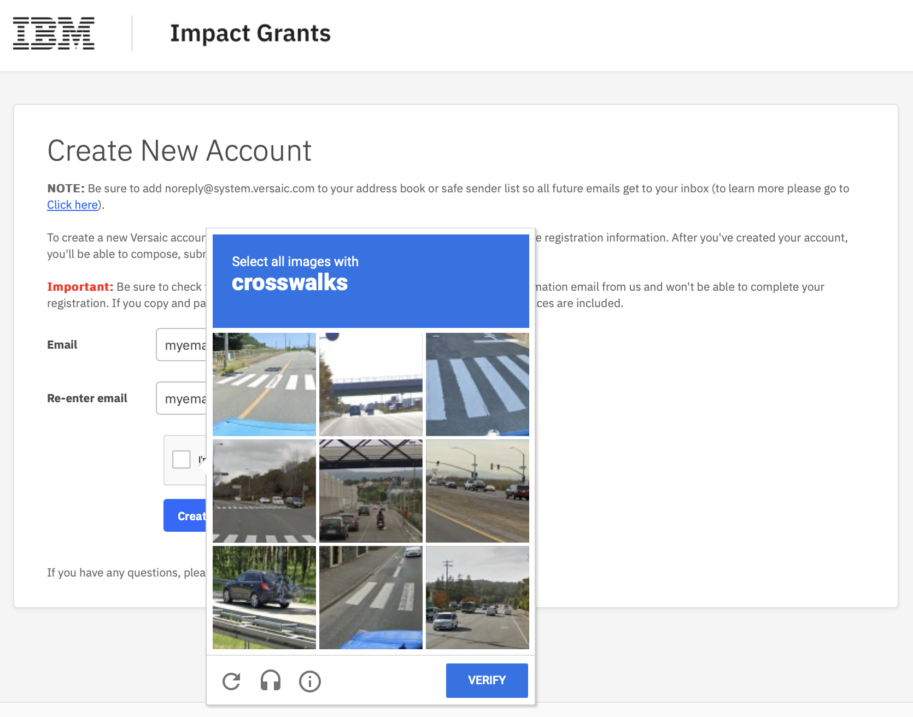

# How to Create a Portal Account

## Step 1 - Visit [ibm.versaic.com](https://ibm.versaic.com) in a web browser

 

## Step 2 - Click to Create an account

 

## Step 3 - Enter a valid **email address** in both boxes. 

 

## Step 4 - Check the "I'm not a robot" checkbox and answer the Captcha challenge.

 
 

## Click the **Create new account** button to proceed.
