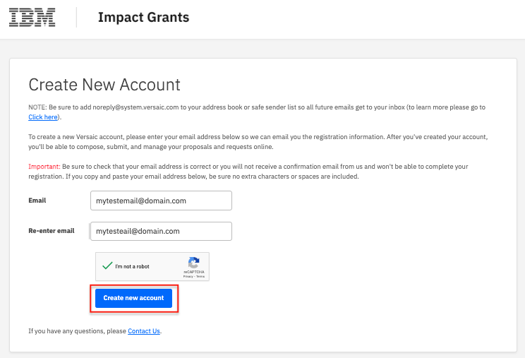

# How to Create a Portal Account

## Step 1 - Visit [ibm.versaic.com](https://ibm.versaic.com) in a web browser

 

## Step 2 - Click the __Create an account__ button

 

## Step 3 - Enter a valid *email address* in both boxes. 

 

## Step 4 - Check the *I'm not a robot* checkbox and answer the Captcha challenge.

 
 

## Step 5 - Click the *Create new account* button to proceed.

 

## Step 6 - Your account has been created and you can complete your profile details. Click *Confirm* when you are done.

 

<picture>
  <source media="(prefers-color-scheme: dark)" srcset="https://user-images.githubusercontent.com/25423296/163456776-7f95b81a-f1ed-45f7-b7ab-8fa810d529fa.png">
  <source media="(prefers-color-scheme: light)" srcset="https://user-images.githubusercontent.com/25423296/163456779-a8556205-d0a5-45e2-ac17-42d089e3c3f8.png">
  
</picture>