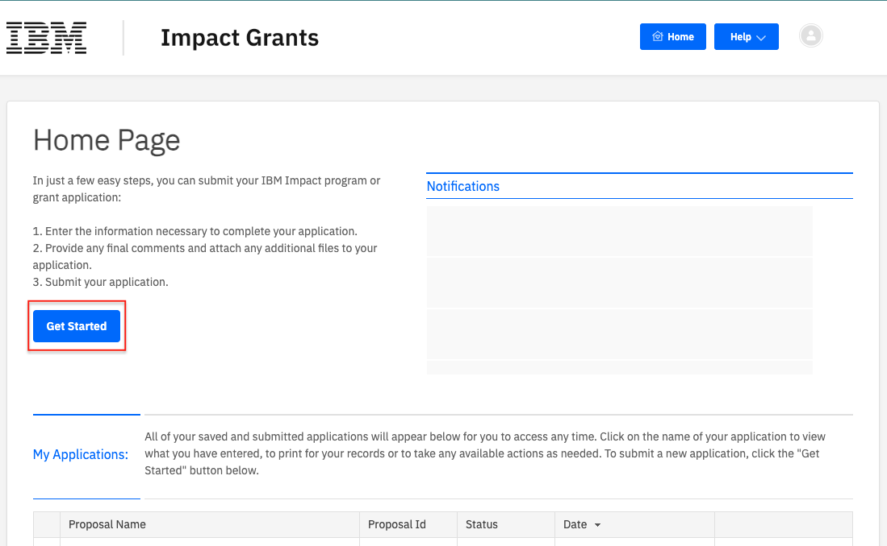
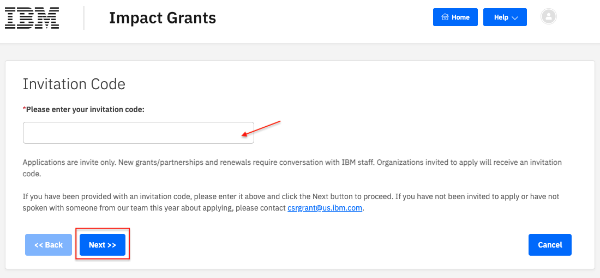
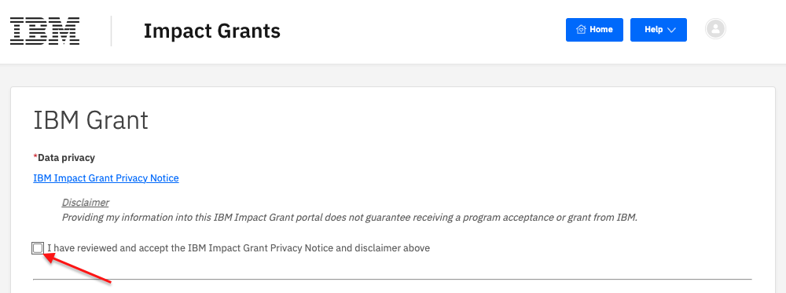
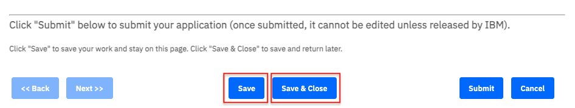
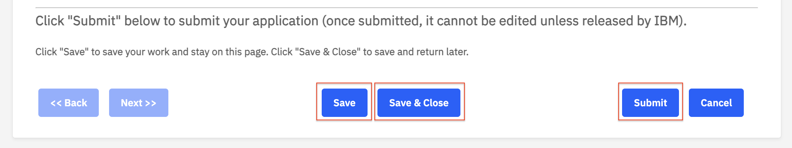

# How to Start an Application

## Step 1 - Click the "Get Started" button

 

## Step 2 - Enter your Invitation Code
An invitation code from IBM is necessary to proceed. Please reach out to your IBM contact if you do not have an invitation code.

 

## Step 3 - Accept the Data Privacy Statement

 

## Step 4 - Complete the application questions

Required questions are designated with a red asterisk and include:

- Grant application name
- Full organization legal name in English
- Country of organization headquarters
- Entity type of organization
- Mission statement / organization description
- Primary focus area
- Organization reach
- Address of organization headquarters
- City of organization headquarters
- Postal code of organization headquarters
- Country registration number
- Country registration documentation
- Primary contact at organization (name, job title, email address and phone number)
- Authorized signer contact at organization (name, job title, email address)
- Referring IBM employee (name and email), if any

## Step 5 - Choose to Save, Save & Close
You can save your answers by clicking **Save** or **Save & Close** at the bottom of the form.

 

## Step 6 - Submit the form when you are complete

 