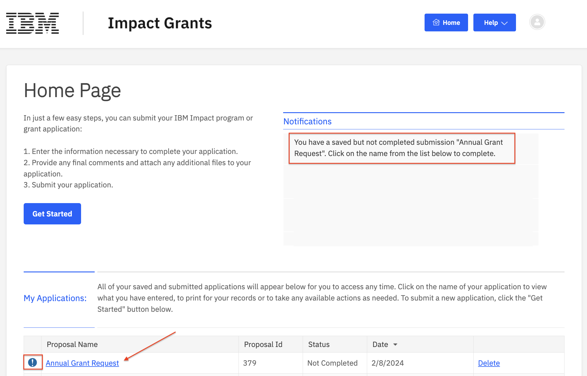

# How to Continue / Edit an Application

## Step 1 - Log in to the [IBM Impact Grants](https://ibm.versaic.com) portal

If you have a draft application, your homepage will show a notification about required actions. 

## Step 2 - On your Homepage, select the draft application to open it

 

## Step 3 - Click the "Required Actions" button, then select "Continue / Edit IBM Grant"

 

## Step 4 - Complete any remaining fields on the application

Required questions are designated with a red asterisk and include:

- Grant application name
- Full organization legal name in English
- Country of organization headquarters
- Entity type of organization
- Mission statement / organization description
- Primary focus area
- Organization reach
- Address of organization headquarters
- City of organization headquarters
- Postal code of organization headquarters
- Country registration number
- Country registration documentation
- Primary contact at organization (name, job title, email address and phone number)
- Authorized signer contact at organization (name, job title, email address)
- Referring IBM employee (name and email), if any

## Step 5 - Choose to Save, Save & Close or Submit the application

Click "Save" to save your work and stay on the application page. Click "Save & Close" to save and return later.

Please note, you **must** click the "Submit" button to submit your application.

 