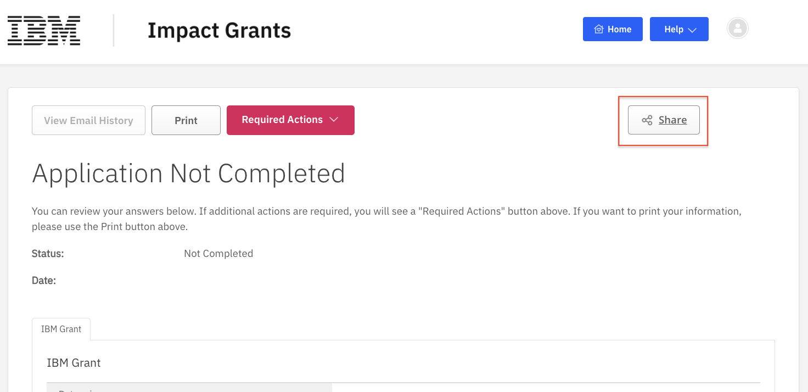

# How to Share an Application

You can share a grant application with a colleague to view and complete it.

## Step 1 - Follow the instructions to [Start an Application](../03-how-to-start-application/readme.md) and save it as a draft

## Step 2 - Follow the instructions to [Continue an Application](../04-how-to-continue-edit-application/readme.md)

## Step 3 - Click the "Share" button

 