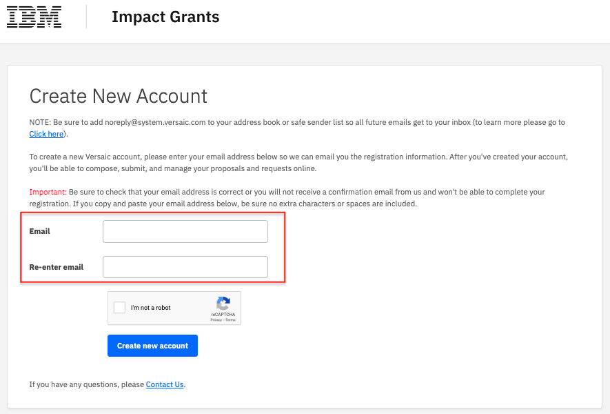
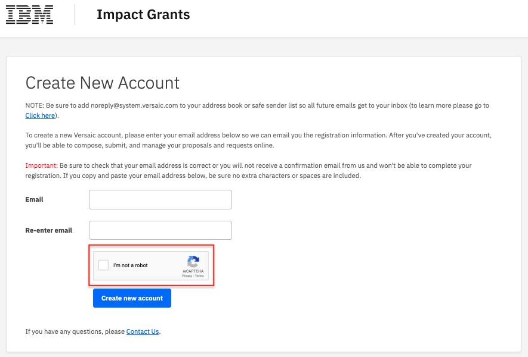

# Cómo crear una cuenta de portal

## Paso 1: visite [ibm.versaic.com](https://ibm.versaic.com) en un navegador web

     

## Paso 2: haga clic en "Create an account"

     

## Step 3 - Enter a valid email address in both boxes. 

     

## Step 4 - Check the "I'm not a robot" checkbox and answer the Captcha challenge.

     
     

## Step 5 - Click the "Create new account" button to proceed.

     

## Step 6 - Your account has been created and you can complete your profile details.

     

